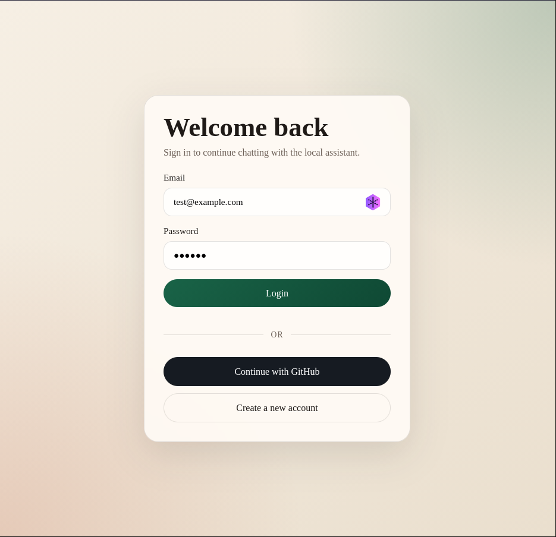
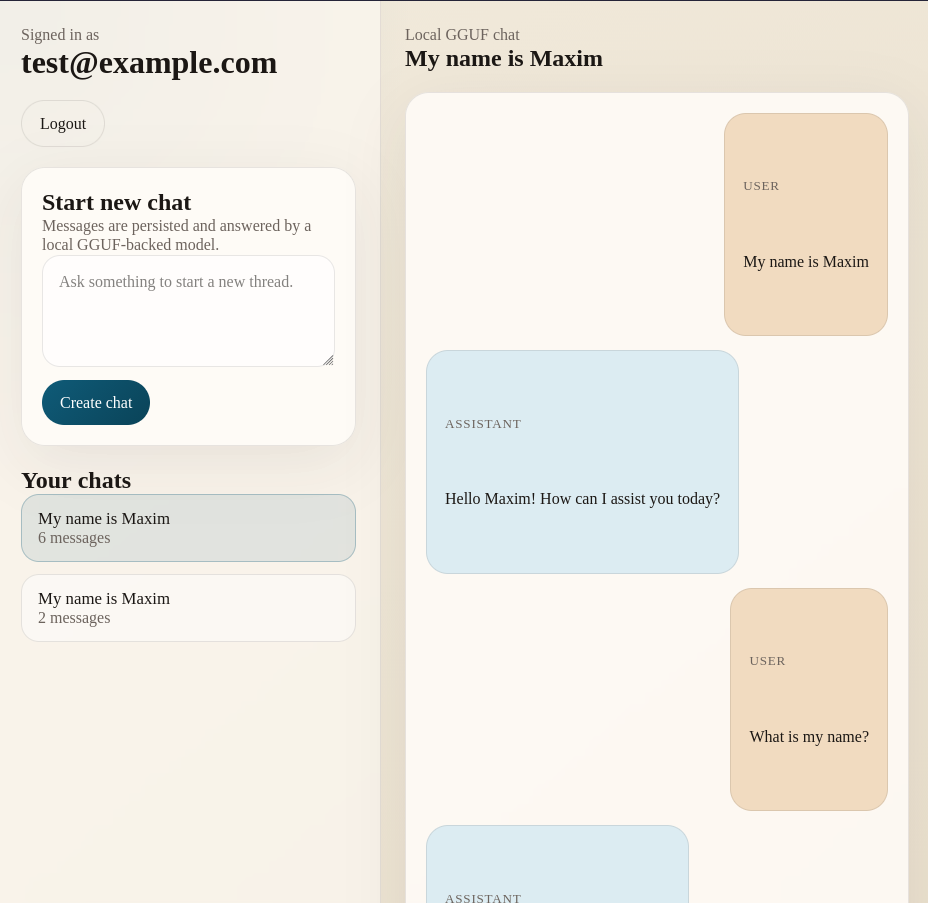
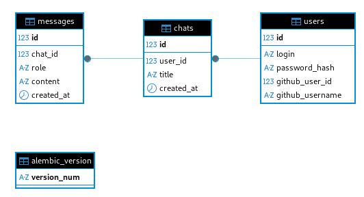

# Project Report

## API Structure

### Application shape

- The FastAPI app is created in `app/__main__.py`.
- Routers are registered from `app.controllers.auth` and `app.controllers.chat`.
- The API mixes JSON auth endpoints with server-rendered HTML chat endpoints.
- Authentication for protected routes uses `Authorization: Bearer <access_token>`.
- Refresh sessions are stored in Redis and rotated through the refresh endpoint.

### Main route groups

#### Auth pages

- `GET /login` renders the login page.
- `GET /register` renders the registration page.

These are browser entry points. The frontend JavaScript then talks to the auth API and stores tokens client-side.

#### Auth API: `/api/auth`

- `POST /api/auth/register`
  - JSON body: `{"login": "user@example.com", "password": "..."}`
  - Creates a user and returns a token pair.
- `POST /api/auth/login`
  - JSON body: `{"login": "user@example.com", "password": "..."}`
  - Verifies credentials and returns a token pair.
- `POST /api/auth/refresh?refresh_token=...`
  - Rotates the refresh token and returns a fresh token pair.
- `POST /api/auth/logout?refresh_token=...`
  - Deletes the refresh session from Redis.
- `GET /api/auth/github/login`
  - Starts the GitHub OAuth flow.
- `GET /api/auth/github/callback`
  - Completes GitHub OAuth and redirects back to `/login` with issued tokens in the query string.

Token pair returned by auth endpoints:

```json
{
  "access_token": "<jwt>",
  "refresh_token": "<opaque-redis-backed-token>",
  "token_type": "bearer"
}
```

#### Chat UI and chat actions

- `GET /`
  - Redirects to `/chats`.
- `GET /chats`
  - Renders the chat workspace HTML.
  - Optional query parameter: `chat_id`.
- `POST /chats`
  - Form field: `prompt`
  - Creates a new chat, generates the first assistant reply, then redirects to `/chats?chat_id=...`.
- `POST /chats/{chat_id}/messages`
  - Form field: `prompt`
  - Appends a user message, generates an assistant reply, then redirects back to the chat page.

#### Streaming chat endpoints

- `POST /chats/stream`
  - Form field: `prompt`
  - Creates a new chat and streams the assistant reply.
- `POST /chats/{chat_id}/messages/stream`
  - Form field: `prompt`
  - Appends a new user message and streams the assistant reply.

Streaming uses Server-Sent Events with these event types:

- `meta`: initial chat metadata such as `chat_id`, `chat_url`, and title.
- `token`: incremental model output chunks.
- `done`: final metadata after the assistant reply is persisted.
- `error`: runtime or model errors.

### How clients use the API

Typical browser flow:

1. Open `/login` or `/register`.
2. Submit credentials to `/api/auth/register` or `/api/auth/login`.
3. Store `access_token` and `refresh_token` on the client.
4. Send `Authorization: Bearer <access_token>` on protected chat requests.
5. Use `/api/auth/refresh` when the access token expires.
6. Submit chat prompts as HTML form posts or use the SSE endpoints for token streaming.

### Short OpenAPI-style excerpt

```yaml
paths:
  /api/auth/register:
    post:
      tags: [auth]
      summary: Register a new user account and issue a token pair
  /api/auth/login:
    post:
      tags: [auth]
      summary: Authenticate a user and issue a token pair
  /api/auth/refresh:
    post:
      tags: [auth]
      summary: Rotate a refresh token and issue a fresh token pair
  /chats:
    get:
      tags: [chat]
      summary: Render the chat workspace for the current user
    post:
      tags: [chat]
      summary: Create a new chat from the first user prompt
  /chats/{chat_id}/messages:
    post:
      tags: [chat]
      summary: Append a new message to an existing chat
  /chats/stream:
    post:
      tags: [chat]
      summary: Create a chat and stream the assistant response incrementally
  /chats/{chat_id}/messages/stream:
    post:
      tags: [chat]
      summary: Append a user message and stream the assistant response incrementally
```

## Screenshots

### UI screenshots





### DB schema screenshots



## Code Structure

### Top-level layout

- `app/__main__.py`
  - FastAPI entrypoint and router registration.
- `app/config.py`
  - Pydantic settings tree loaded from `.env`.
- `app/db.py`
  - Async SQLAlchemy engine, session factory, and request-scoped DB dependency.
- `app/controllers/`
  - HTTP layer: routes, status codes, template responses, redirects, and streaming responses.
- `app/services/`
  - Business logic: auth, chat orchestration, security helpers, Redis access, and local LLM integration.
- `app/repositories/`
  - Persistence helpers for reading and writing SQLAlchemy models.
- `app/models/`
  - SQLAlchemy entities for users, chats, and messages.
- `app/schemas/`
  - Pydantic request and response models for JSON endpoints.
- `app/forms/`
  - Pydantic models for HTML form payloads.
- `app/templates/`
  - Jinja2 server-rendered pages for auth and chat screens.
- `app/alembic/`
  - Migration environment and revision history.

### Layer responsibilities

#### Controllers

- `app/controllers/auth.py`
  - Auth API endpoints, login/register pages, GitHub OAuth redirects and callback handling.
- `app/controllers/chat.py`
  - Chat page rendering, create/send message actions, and SSE streaming responses.

Controllers stay thin: they validate HTTP input, call services, and shape the HTTP response.

#### Services

- `app/services/auth.py`
  - Registration and login flow.
  - Access-token resolution for protected routes.
  - Refresh-token storage and rotation using Redis.
  - GitHub OAuth integration.
- `app/services/chat.py`
  - Chat creation, title generation, user message persistence, and assistant reply persistence.
- `app/services/llm.py`
  - Loads the local GGUF model through `llama-cpp-python`.
  - Supports full-response generation and token streaming.
- `app/services/security.py`
  - Argon2 password hashing and verification.
  - JWT creation and validation.
- `app/services/redis.py`
  - Cached async Redis client.

This layer contains most of the application behavior.

#### Repositories

- `app/repositories/users.py`
  - User lookup, creation, and GitHub identity updates.
- `app/repositories/chats.py`
  - Chat lookup/listing and message/chat insertion helpers.

Repositories isolate SQLAlchemy query details from the service layer.

#### Models

- `app/models/user.py`
  - `User` entity with unique email login, password hash, and optional GitHub identity.
- `app/models/csat.py`
  - `Chat` entity owned by a user and ordered message relationship.
- `app/models/message.py`
  - `Message` entity with role, content, timestamp, and chat link.
- `app/models/base.py`
  - Shared SQLAlchemy declarative base.

### Important implementation details

- Authentication is stateless for access tokens and stateful for refresh tokens.
  - JWT access tokens are signed with the configured secret.
  - Refresh tokens are opaque random strings stored in Redis with TTL.
- The UI is server-rendered, but not session-based.
  - Pages are rendered with Jinja2.
  - Auth still relies on Bearer tokens rather than cookies.
- LLM responses support both blocking and streaming flows.
  - Non-streaming endpoints generate the whole reply before redirecting.
  - Streaming endpoints persist the user message first, stream assistant tokens, then persist the final assistant message.
- The code follows a clear MVC-style split.
  - Models: SQLAlchemy entities.
  - Views: Jinja2 templates.
  - Controllers: FastAPI routers.
  - Service/repository layers provide the application and persistence logic underneath MVC.
